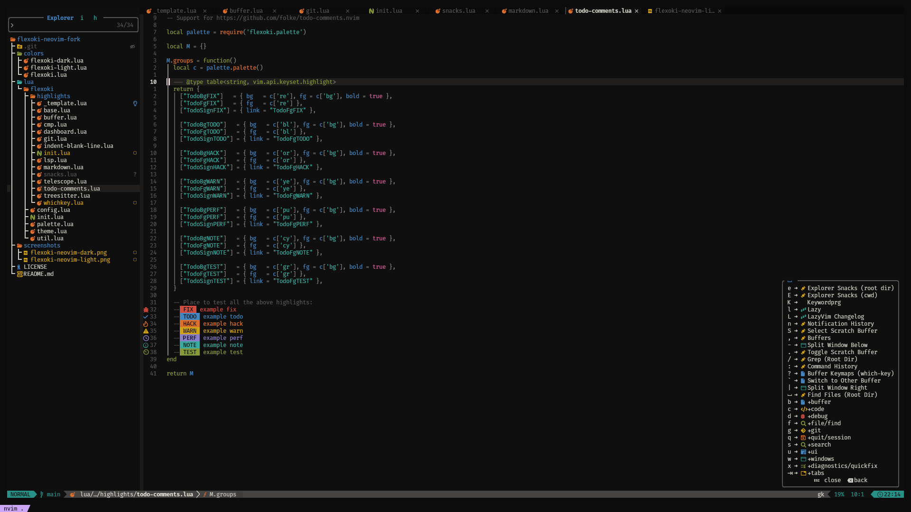
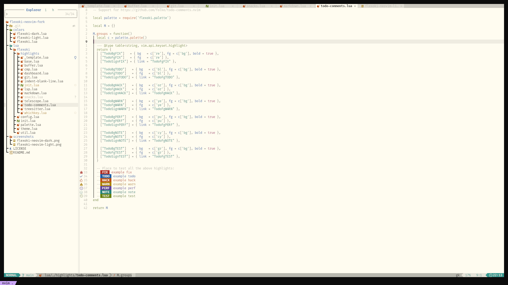

# flexoki-neovim
Neovim adaptation of [Flexoki](https://stephango.com/flexoki) by Steph Ango forked by me, [hyduez](https://codeberg.org/paulo)

I use it for my daily journal






## Installation
To install simply add via your plugin manager and call the theme

**[lazy.nvim](https://github.com/folke/lazy.nvim)**

```lua
require("lazy").setup({
  { 'hyduez/flexoki-neovim-fork', name = 'flexoki' }
})
```

**[packer.nvim](https://github.com/wbthomason/packer.nvim)**

```lua
require('packer').startup(function(use)
  use({ 'hyduez/flexoki-neovim-fork', as = 'flexoki' })
end)
```

**[Paq](https://github.com/savq/paq-nvim)**

```lua
require('paq')({
  { 'hyduez/flexoki-neovim-fork', as = 'flexoki' }
})
```

## Usage

* Dark

```lua
-- Set colorscheme after options
vim.cmd('colorscheme flexoki-dark')
```

* Light

```lua
-- Set colorscheme after options
vim.cmd('colorscheme flexoki-light')
```
